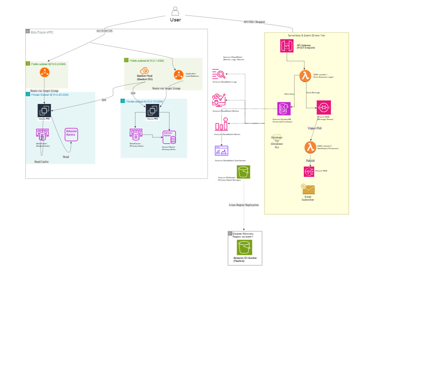

# EduTrack Nigeria: National Student Management Platform

## Overview
EduTrack Nigeria is a government-scale National Student Management Platform. The infrastructure is designed to support 500 universities, 3 million students, and 120,000 staff. A critical requirement of this deployment is multi-tenancy, guaranteeing strict institution data isolation at both the IAM and network layers. The architecture is highly available, optimized for low-bandwidth connections, and enforces data sovereignty by keeping all primary storage within the af-south-1 region, supported by Cross-Region Disaster Recovery in eu-west-1 region.

## Architecture Diagram

## Services Deployed
This platform relies on a highly resilient hybrid architecture, blending a traditional 3-tier web infrastructure with an event-driven serverless pipeline:

**Foundation & Identity:** A Custom VPC spanning 2 AZs containing 4 subnets (2 public, 2 private), an Internet Gateway, strict Security Groups per tier, a Bastion Host, and a minimum of 3 IAM roles enforcing least-privilege policies.
**Compute & Scaling:** EC2 web instances residing in private subnets, dynamically managed by an Auto Scaling Group triggering a scale-out on CPU > 50%, and distributed via an Application Load Balancer.
**Storage:** Amazon S3 utilized for static website hosting and asset storage, featuring lifecycle rules, versioning, SSE-S3 encryption, and Cross-region replication to eu-west-1.
**Databases:** An Amazon Aurora cluster handling relational data in a private subnet, an ElastiCache Redis node executing a cache pattern with TTL, and Amazon DynamoDB managing high-throughput transcript lookups with a Global Secondary Index.
**Serverless & Events:** An asynchronous data ingestion layer decoupling operations using an HTTP API Gateway with a live POST endpoint, two Lambda functions with different responsibilities, an SQS decoupling queue, and SNS for automated email alerts.
**Observability:** Centralized monitoring via CloudWatch, including a dashboard tracking 3+ services, metric alarms triggering SNS actions, and Logs Insights queries for troubleshooting.

## How to Test
The serverless ingestion pipeline is exposed via a public HTTP API Gateway POST endpoint. You can simulate a student registration payload directly from your terminal.

curl -X POST https://iwqnyjifn3.execute-api.af-south-1.amazonaws.com/register \
     -H "Content-Type: application/json" \
     -d '{
      "University_ID": "ABUAD",
      "Student_ID": "STU-2020",
     "First_Name": "Diran",
      "Last_Name": "Kayode",
     "Department_ID": "Engineering"
}'
